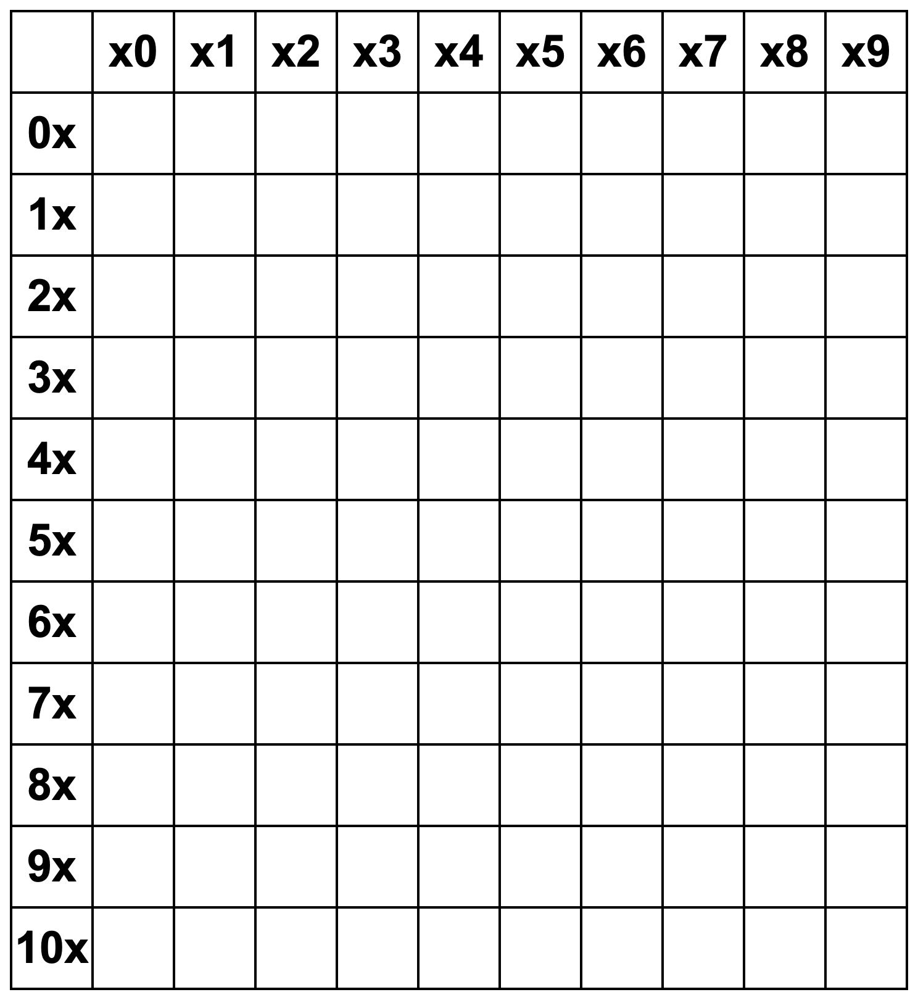
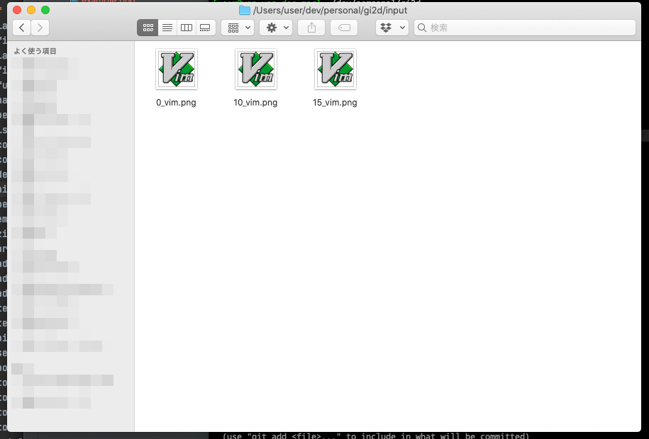
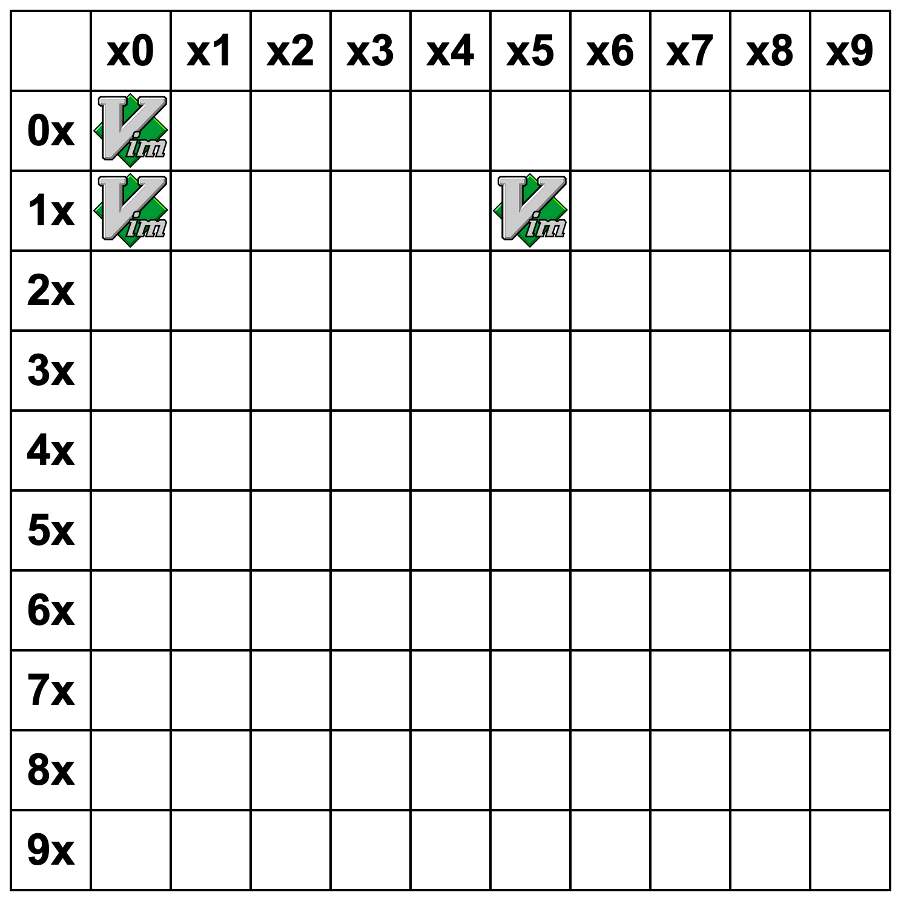

# GI2D

  

# About

アレを生成します。(正式名称がわからない)  

# 使い方

ファイル名の形式は「番号_ファイル名.png」です。  
こんな感じに配置したら...  



ディレクトリを指定して実行します。  

```bash
$ java -jar target/scala-2.13/GI2D-assembly-0.1.0-SNAPSHOT.jar -d ./input
```

こんな感じに出力されます。  



# オプション

| オプション名 | オプション名(省略) | 説明 | デフォルト値 |
| :--- | :--- | :--- | :--- |
| dir | d | 読み込む画像がおいてあるディレクトリ | . |
| line | l | 行数 | 10 |
| border-weight | | 線の太さ | 4 |
| margin | | 上下左右の余白 | 16 |
| cell-size | | マスの大きさ | 128 |
| output | o | 出力ファイル名 | output.png |

## 注意事項

- 出力形式はpng形式のみです。
